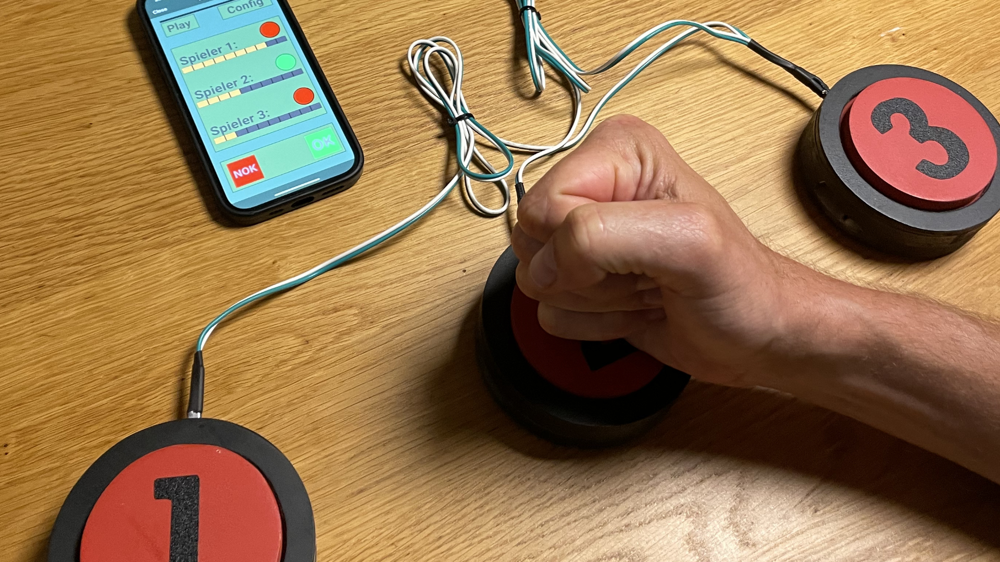

Maker Media GmbH

***

# Quiz-Buzzer mit RemoteXY

### Bei einem Quiz kann es gerne mal drunter und drüber gehen. Selbstgebaute Buzzer mit ESP32 sorgen da schon für etwas Ordnung. Richtig fair wird es aber erst mit einem unparteiischen Spielleiter. Hier kann eine RemoteXY-App helfen, die den aktuellen Spielstand auf einem Smartphone-Bildschirm abbildet und für den typischen Buzzer-Sound sorgt.

Ergänzend zum Artikel in der Make 6/24 findet ihr hier die Pläne und den Code für die Quiz-Buzzer.

Den vollständigen Artikel kann man in der **[Make-Ausgabe 6/24](https://www.heise.de/select/make/2024/6)** lesen.
